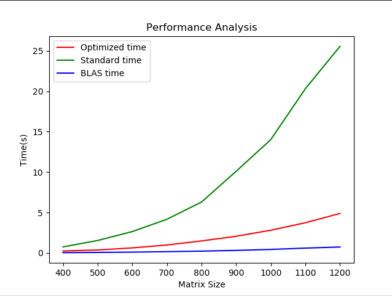

Name: Miruna-Elena Banu

Group: 331CAa

# Assignment 2

## Description

### **solver_neopt.c**

For this, I implemented the standard matrix multiplication algorithm with the
mention that for the upper triangular matrix and its transpose I have changed
the "for" values so that it would ignore the 0 values.

I did not find the need to compute the transpose matrices since it could be
done in place by changing the indices:

```
ABB_t[i * N + j] += AB[i * N + k] * B[j * N + k];
```

```
A_tA[i * N + j] += A_t[k * N + i] * A[k * N + j];
```

### **solver_blas.c**

For this, I have used the **cblas** functions:

* cblas_dtrmm - which mutiplies a triangular matrix and a standard matrix

* cblas_dgemm - which does the following operation: 
  ```
  C←αAB + βC or C←αBA + βC
  ```

Both of which have been given the right parameters to return the desired result:

```
A x B: cblas_dtrmm(
		    CblasRowMajor,
		    CblasLeft,
		    CblasUpper,
		    CblasNoTrans,
		    CblasNonUnit,
		    N, N, 1.0, A, N,
		    AB, N);

A_t x A: cblas_dtrmm(
		    CblasRowMajor,
		    CblasLeft,
		    CblasUpper,
		    CblasTrans,
		    CblasNonUnit,
		    N, N, 1.0, A, N,
		    A_tA, N);

(A x B) x B_t + A_t x A:
    cblas_dgemm(
		CblasRowMajor,
		CblasNoTrans,
		CblasTrans,
		N, N, N, 1.0, AB,
		N, B, N, 1.0, sum, N);
```

### **solver_opt.c**

For this, I have chosen to do the following optimisations:
- computed the transpose matrices
- for switch to the forms of i-k-j and k-i-j
- eliminating the constants from the loops by using the value at the said pointer
- using the processor's registers to store the pointers to avoid memory access
overhead
- computing the matrices in 2x2 blocks to increase the speed


### Solution comments

I believe that this project was useful because I learned how to optimize my
code and, also, I gained a better understanding of the concepts of triangular
matrices. It was also very exciting to learn about the blas functions and to
analyze the elapsed times for each of the three versions.

I believe my implementation to be good enough. I do not think that it is the
best, there are definitely countless better ways to do it, some of which I
have thought about myself, however I did not manage to implement them due
to the fact that I started working on this project later than I would have
liked to (Easter holidays are a killer). 

## Implementation

The current project represents an analysis of three matrix multiplication
techniques: the standard algorithm, the BLAS functions implementation, and 
a memory access optimized version.

The standard implementation (*solver_neopt.c*) is based on the standard
matrix multiplication algorithm and the triangular matrix concepts.

The blas implementation (*solver_blas.c*) is based on the usage of the 
BLAS functions and the triangular matrix concepts.

The optimized implementation (*solver_opt.c*) is based on multiple
optimization techniques, all of them having already been mentioned in
an above section.

The task is fully implemented.

A thing that I found counter-intuitive is the usage of the BLAS
functions, it is extremely confusing in some cases.

A follow-up thing that came to my attention was the fact that I was initially
doing the transpose in-place for the optimized version, and, in this manner,
I was unable to see that the for switching was not as helpful as it should have
been. Thus, I chose to compute the transpose and then solve the equation
without inter-changing the indices, and the speed gained was considerably
higher.

Something that I actually found interesting is the speed that the BLAS
functions have. I was not expecting such low times.

## Performance Analysis Graph



Input file for the analysis: 

```
9
400 123 out1
500 789 out2
600 245 out3
700 354 out4
800 456 out5
900 678 out6
1000 397 out7
1100 468 out8
1200 789 out9

```

This graph suggests that the BLAS implementation is by far the fastest,
seeming to be an almost linear scaling factor. However, all of them are
exponentially growing with time. It is also obvious that the optimized
version runs faster than the standard version. 

## Cachegrind

By analyzing the .cache files, we can compare the three implementations by
branches, instruction misses, data cache misses, last level misses
and mispredicts.

Thus, here are the results:
- neopt: - I1  misses: 1,327
         - D1  misses: 76,651,533
         - LL  misses: 123,887
         - Branches: 131,736,914
         - Mispredicts: 490,815

- opt: - I1  misses: 1,335
       - D1  misses: 10,639,260
       - LL  misses: 143,885
       - Branches: 43,401,315 
       - Mispredicts: 215,285

- blas: - I1  misses: 2,248
        - D1  misses: 1,789,496
        - LL  misses: 145,444
        - Branches: 3,895,187 
        - Mispredicts: 43,050 

The conclusion is that, surprisingly, the opt_m has the lowest rate of data cache
misses (1.7%) and mispredict (0.5%), followed by blas with data cache
misses (2.0%) and mispredict rate (1.1%) and neopt with data cache
misses (2.6%) and mispredict rate (0.4%).


## 


## Resources

[1] https://ocw.cs.pub.ro/courses/asc/laboratoare/05

[2] https://developer.apple.com/documentation/accelerate/blas

[3] https://www.vedantu.com/maths/upper-triangular-matrix

[4] https://www.geeksforgeeks.org/understanding-register-keyword/

[5] https://en.wikipedia.org/wiki/Loop_unrolling

[6] https://valgrind.org/docs/manual/cg-manual.html

## GIT

https://github.com/mirub/matrix-multiplication
